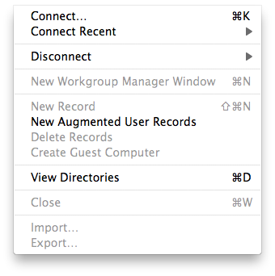
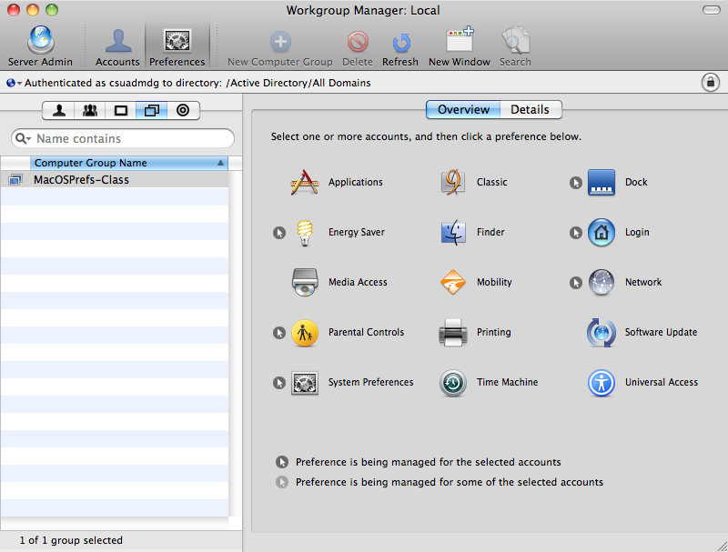
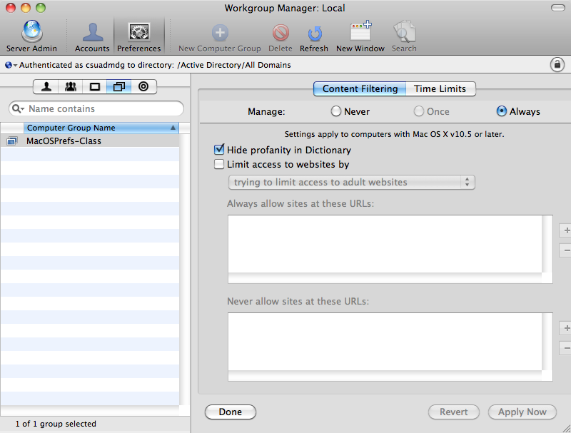

A follow-up to my earlier article "MacOSX (10.6), Managed Preferences without OSX Server", this is just a run through of what to do once you've got your Macs in the Active Directory (AD) and want to manage the policies on groups of machines (computer-lists, in Apple terminology), instead of managing preferences individually for each machine.

First of all, a computer-list 'group' is needed, which AD doesn't know about, as groups in AD are universal, and not split by member object type. This means we will need to open [ADSI Edit](http://technet.microsoft.com/en-us/library/cc773354(WS.10).aspx) and create an object based on the computer-list class and then manually add the machine accounts to it, as AD doesn't see this object as a group. When you add machines to this group, you need to specify the machine's object name in AD (the machine name, followed by the $ sign). Look [here](http://hintsforums.macworld.com/showthread.php?t=118703) for more info + images on how that looks.

Once the computer-list is created and the Macs are added into this group, you can manage the preferences just by changing the group's attributes with Workgroup Manager, shown below. After opening Workgroup Manager, you need to 'View Directories', as you can't connect to AD in the same way Workgroup Manager would connect to Open Directory (OD). Then you have to authenticate yourself with your AD account set up to administer the computer-list group. This is so you don't have to log into the Mac with Workgroup Manager as an admin all the time.

Once you've logged in and found your computer-list group, the journey is nearly over, all that's left is to change some preferences! We don't want any profanity displayed in the dictionary now, do we?

That's pretty much it, it's a little annoying having to support the machine group with ADSI Edit, but I'm sure some powershell scripting that automatically adds machines with iMac or apple in the name to this group would be pretty easy.