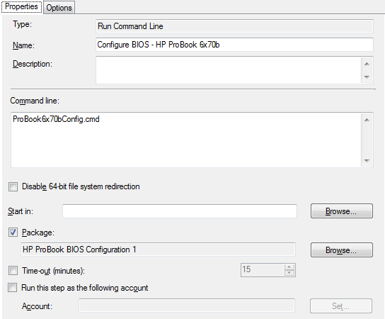
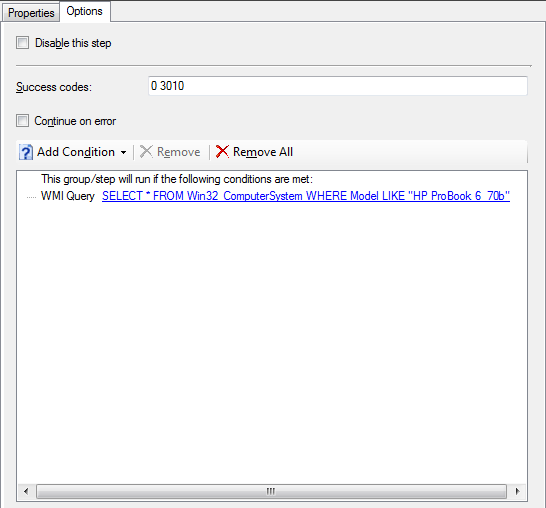

If you've come to this post directly, you may want to [read through part 1](https://tookitaway.co.uk/2014-07-29/sccm-2012-r2-updating-and-configuring-hp-probook-6470b6570b-bios-in-a-task-sequence-part-1)! If not, read on...

In this part, we'll cover putting the files we've got together in a couple of packages and putting them into a task sequence. We'll also be using WMI to query the computer model, so we don't try updating the BIOS on a machine it certainly won't work on.

I've set up the files I need in the following hierarchy, and spread the BIOS configuration and update over two packages. You may decide to do it differently.

    SCCMSources\OSD\Packages\BIOSConfig\HP ProBook

        BiosConfigUtility.exe   (BIOS configuration utility - x86)
        BiosConfigUtility64.exe (BIOS configuration utility - x64)
        BIOSPW.bin              (Encrypted BIOS password)
        ProBook6x70bConfig.cfg  (BIOS configuration settings)
        ProBook6x70bConfig.cmd  (BIOS configuration command file)

    SCCMSources\OSD\Packages\BIOSUpdate\HP Probook
    
        BIOSPW.bin              (Encrypted BIOS password)
        HPBIOSUPDREC.exe        (New BIOS update utility)
        hpqFlash.exe            (Old BIOS update utility)
        ProBook6x70bBIOS.cab    (HP Probook 6x70b BIOS file)

##### NOTE

"SCCMSources" is my network share I store the SCCM source files to use as the content location for applications and packages. I then have "OSD\Packages" to differentiate these packages as being primarily for OSD task sequences. Hopefully the "BIOSUpdate" and "BIOSConfig" folders will eventually house many folders for different types of laptop, but at the moment it's a bit bare.

## Configuring the BIOS

Most of the magic for configuring the BIOS is done in the file [ProBook6x70bConfig.cmd](https://gist.github.com/davegreen/758de1c4d707002506e6)

This batch file picks the correct version of BiosConfigUtility to run (x86 or x64), then runs it with the configuration file. It runs it first, attempting to get access to the BIOS using a blank password, then set the password along with the configuration. If this completes successfully (exit code 0), that's it!

However if it fails for some reason (i.e. there's a BIOS password set) It then runs the second command, which attempts to set the configuration, using the current password. I've yet to properly test a parameterized version of this, to allow the configuration to be specified outside of the batch file.

This is run in the SCCM task sequence, at the beginning, before provisioning or enabling Bitlocker, but after formatting the drive, so that on the reboot that occurs directly afterward, using an "Restart Computer" task, the boot image can be successfully staged to the hard disk.

The options base the running of this task on the computer model name, so that we dont try to configure an incompatible BIOS or some other crazy situation. It's not too clear in the image, but I'm using the single character wildcard "_" in the model - "SELECT * FROM Win32_ComputerSystem WHERE Model LIKE "HP ProBook 6_70b""

Hopefully this has covered everything that's needed for yourself to go forth and configure the HP ProBook BIOS in an unattended way! As with most of my posts, please let me know if you've discovered improvements or inaccuracies and I'll attempt to right them!

Read on, where I cover the flashing of the BIOS in [part three](https://tookitaway.co.uk/2014-08-01/sccm-2012-r2-updating-and-configuring-hp-probook-6470b6570b-bios-in-a-task-sequence-part-3).
