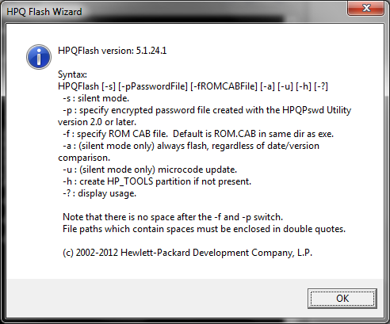
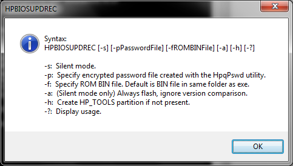
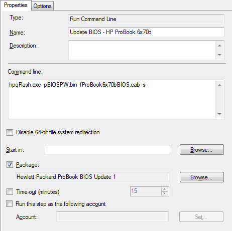
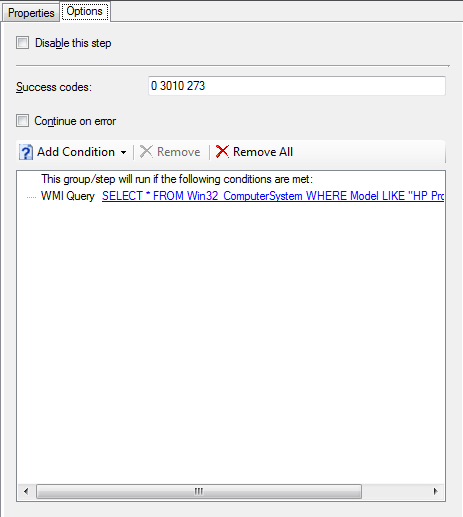

If you’ve come to this post directly, it's probably useful for you to read through both [part 1](https://tookitaway.co.uk/2014-07-29/sccm-2012-r2-updating-and-configuring-hp-probook-6470b6570b-bios-in-a-task-sequence-part-1) and [part 2](https://tookitaway.co.uk/2014-08-01/sccm-2012-r2-updating-and-configuring-hp-probook-6470b6570b-bios-in-a-task-sequence-part-2)! If however you've already got that under your belt, read on…

As a recap, you'll remember that I decided to set up two packages for the configuring and updating of the BIOS. Just in case you want a reference for the BIOS update portaion of the structure, here it is again.

    SCCMSources\OSD\Packages\BIOSUpdate\HP Probook
        BIOSPW.bin              (Encrypted BIOS password)
        HPBIOSUPDREC.exe        (New BIOS update utility)
        hpqFlash.exe            (Old BIOS update utility)
        ProBook6x70bBIOS.cab    (HP Probook 6x70b BIOS file)

## Updating the BIOS

This time, most of the hard work is actually done in the Operating System Deployment (OSD) task. The task needs to be set up to call the BIOS flash tool (Either HPBIOSUPDREC.exe or hpqFlash.exe (depending on the BIOS you need to flash). For the 6x70b's, hpqFlash.exe is the one to use! The call to the BIOS flash tool follows the following syntaxes.

### hpqFlash

As you can guess, the most interesting command line switches to me are -s -p and -f. Please note, I have not tested and am not 100% sure of the other switches. I can imagine -a could be especially dangerous, so please take care!

### HPBIOSUPDREC

You can see that the switches are exactly the same here, minus the microcode update switch. This is good, as it will make things easier if we automate the selection of flashing tool to use in the future.

This is run in the SCCM task sequence, just after the reboot for configuring the BIOS, but again before provisioning or enabling Bitlocker. Again, there should be a "Restart Computer" task directly after this to finalise the update procedure. As you can see, hpqFlash is called directly with the BIOS password and the cab file to install, as well as the silent switch.

As per the BIOS configuration task, it is based on the computer model name, so that we dont try to flash an incompatible BIOS. If inconsistencies were found that required a different BIOS for the same model, a seperate task could be created with an additional WMI query to obtain another identifying value. You may also see that an additional success code is added (273) this is the code returned by hpqFlash if the BIOS is already up to date and no action is taken. This allows the task sequence to continue as normal if the BIOS is already up to date.

Again, I hope this has been a helpful guide on your path to automating some of the more annoying parts of the imaging process, usually left as manual tasks. As I've said before, please let me know if you’ve got a better way of doing things, or have found some innacuracies with my posts and I'll sort it out.