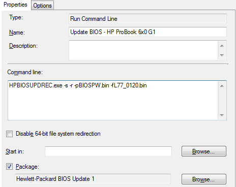
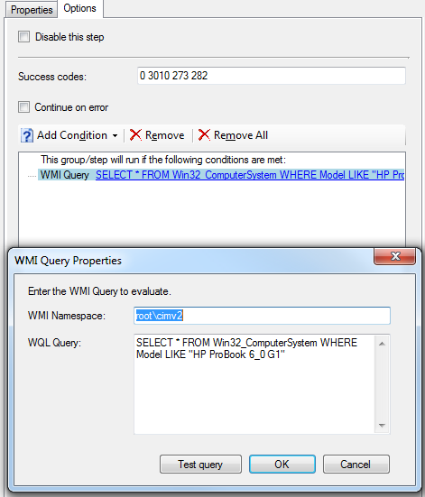

This post is mostly a follow up to my guide on updating other HP ProBook BIOS in a task sequence. If you haven't read that, this might not be of too much use to you!

# The Problem

When updating a HP ProBook 650 G1 BIOS, I ran into a couple of small issues. This mostly related to an undocumented switch being required for the HPBIOSUPDREC tool. The BIOS update would always cause the computer to perform an unexpected reboot, which would break the task sequence.

The command line I was using was:

    HPBIOSUPDREC.exe -s -pBIOSPW.bin -fL77_0120.bin

This would cause the BIOS to update, but then the computer would reboot without returning an exit code to SCCM, causing the task sequence to fail. Searching around, I found [this post on the HP support forums](http://h30499.www3.hp.com/t5/HP-PC-Client-Management/650-G1-Silent-BIOS-Update-With-No-Automatic-Reboot/td-p/6458090#.VE4I_WcqW70), which pointed me in the right direction. Thanks richard429!

# The Solution

The correct command line to update the HP BIOS for the ProBook 650 G1 is as follows:

    HPBIOSUPDREC.exe -s -r -pBIOSPW.bin -fL77_0120.bin

This -r switch appears to be undocumented, which is a shame really, but this prevents the reboot without exit code. The command now returns a correct exit code and lets SCCM reboot the computer gracefully.

# Putting it into Practice

In the SCCM package, I've placed both the HPBIOSUPDREC tool and the BIOS binary file. The task sequence runs it as shown below:

The WMI query makes sure it only runs on the selected/supported HP ProBook 640 G1 and 650 G1's we have in our environment. There's no danger in making this query less specific, as the update tool will only flash machines that the update is applicable to. I have also added the exit codes 273 and 282, which are exit codes for "BIOS is already same version" (273) and BIOS installed is newer than the one set to install (272).