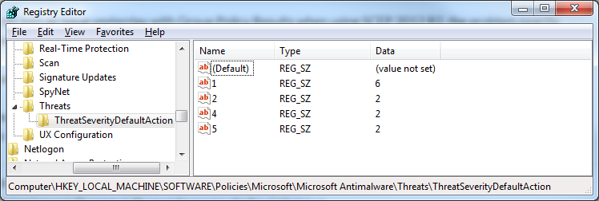

We ran into an issue yesterday with Group Policy Results when using SCEP 2012 R2, the problem exactly follows this particular issue on the [TechNet Forums](https://social.technet.microsoft.com/Forums/en-US/651e9006-adb8-4eb4-ac65-141765d235f0/system-center-endpoint-and-group-policy-results?forum=configmanagergeneral), but appears to affect a couple of extra registry keys.

It's really unfortunate that this still isn't fixed in SCCM 2012 R2, having also been an issue in 2012, as the post describes.

To resolve the problem, I used my existing [SCEP Group Policy ADMX template](https://github.com/davegreen/miscellaneous/tree/master/CustomADMX) in creating a GPO to replicate the default settings pushed out to clients with SCCM, which solves the problem, as the exceptions and settings we push out to standard clients aren't any different from the Microsoft recommended settings.

In the GPO I had to specify the exclusion settings and also the default threat actions, which are specified in the registry here:

    HKEY_LOCAL_MACHINE\SOFTWARE\Policies\Microsoft\Microsoft Antimalware\Threats\ThreatSeverityDefaultAction

Previously these settings were defined as REG_DWORD, but need to be REG_SZ, as shown below:

