I got asked a little while ago if SCOM could query an SQL database and generate an alert in certain circumstances. I was sure it could, since I've seen things do it before, but it wasn't something i'd done myself. It seems like a fairly basic thing to do, but all the documentation I found was a bit scattered across the web, so I'm noting it down here, with links to the sources I used!

Somehow I've managed to get a long way without doing any real SCOM Management Pack authoring... Until now! This made my day a nice learning curve,

Here's the summary of how I went about it.

- Create a new Management Pack (MP) to contain the changes.
- Create the run as profile in the MP.
- Create the monitor in the MP.
- Export the management pack.
- Add the run as reference to the monitor.
- Re-import the management pack.
- Complete the configuration, set up alerting and overrides, etc.

To make things easier we create the framework of the monitor and the run as profile first, to make the manual editing step easier.

# Sources

Massive thanks to the following people and everyone posting about SCOM stuff, a lot of this stuff would be incredibly difficult without their help.

- Stefan Stranger - [Associating Run As Accounts to monitors](http://cid-3ac99c5995164f2b.skydrive.live.com/self.aspx/files/Steps-to-Associate-Run-As-Account-to-monitor.1.0.pdf) ([Mirror](../assets/computers/Steps-to-Associate-Run-As-Account-to-monitor.1.0.pdf))
- Pete Zerger - [How to create a 2 state script monitor](http://www.systemcentercentral.com/wp-content/uploads/2009/04/HOW-TO_2-state_ScriptMonitor.pdf) ([Mirror](../assets/computers/HOW-TO_2-state_ScriptMonitor.pdf))

# Create a new Management Pack (MP) to contain the changes

I started by creating a management pack for whatever monitors I create using this method, since it will need editing. This should help to keep things tidy, allowing me to isolate the changes I'm making from the rest of the system, as is good practice.

Browse to Administration, then right-click on "Management Packs" and choose to create a new management pack.

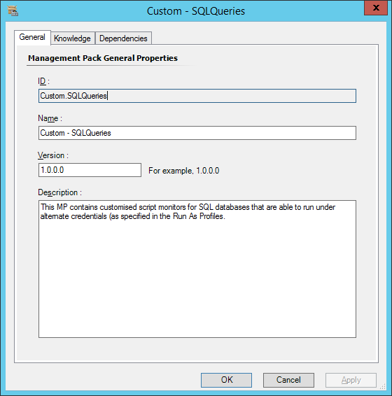

I've named and described my management pack, obviously these will be different in your case.

# Create the run as profile in the MP

Browse to the Administration tab, then right-click "Run As Configuration" and choose to "Create Run As Profile..."

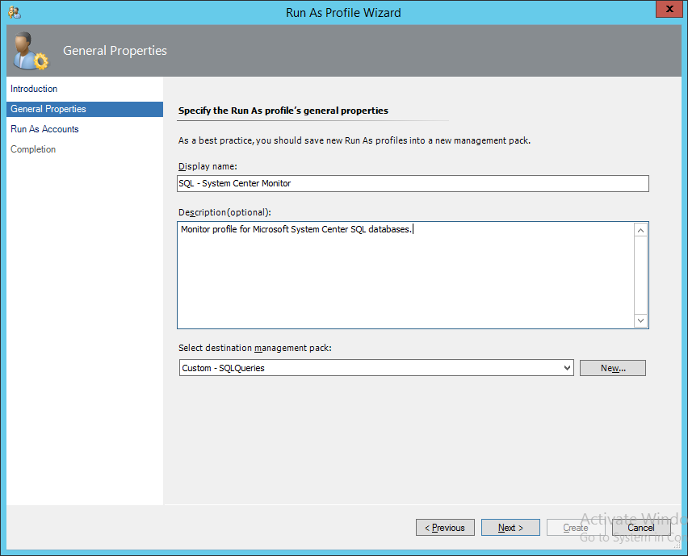

Name and describe the profile how you need it, then choose to put it in the management pack we created. Add the run account you need, then create it.

# Create the monitor in the MP

To create the monitor, I browsed to the Authoring tab, then to "Management Pack Objects > Monitors" and filtered the scope to the following "SQL Server YYYY DB", depending on the SQL Server version containing the database you need to target. I'll be working with SQL Server 2014 for this example, but this method applies to all recent versions of SQL server.

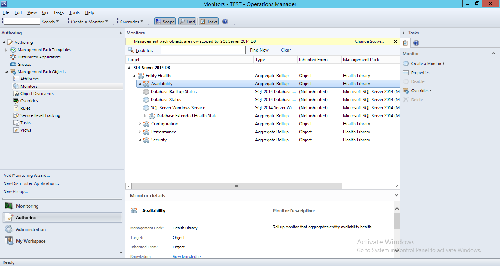

Next we can go ahead and create a new Unit Monitor to hold our script we need to run against the DB. In this example I'll be using a timed script two state monitor.

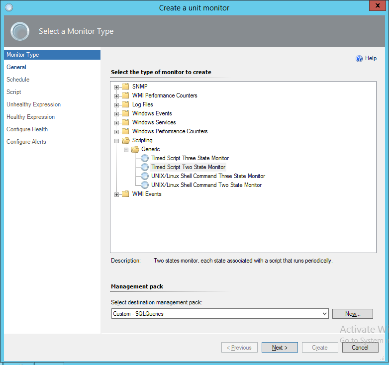

The script monitor should be created in the new management pack we've just created, given a reasonable name and not enabled, since we will create overrides later for the databases this monitor will apply to.

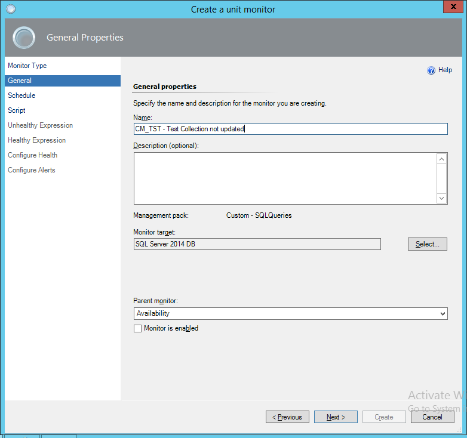

For testing, I'll be setting the schedule of the script to 5 minutes (not shown) and I'll be using the following script as a test monitor, it's just a simple script to grab the last updated time of a collection and pass that back to the property bag for the alert if it's over 20 minutes old. Here's the script and just as importantly the parameters screen to show how the script has been set up.

Here's the script itself:

[Two State Monitor](https://gist.github.com/davegreen/c4e4b2e7039475e058b4)

Take note that the SQL query in the script is made up for this example, but the rest script can be used for many other things. I've used parameters for the database server and database name in the script, so the solution just relies on the script and return values being specified correctly in the lower half of the script.

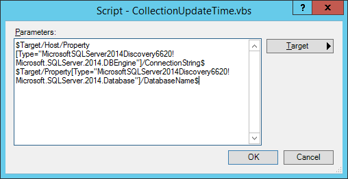

Now we have the script and the parameters sorted out, we can turn our attention to the health expressions. In this example they are set up simply. If we get some records back, there's a problem. It's a simple way to go, and this way round we can hopefully extract some useful reason for why things are unhealthy.

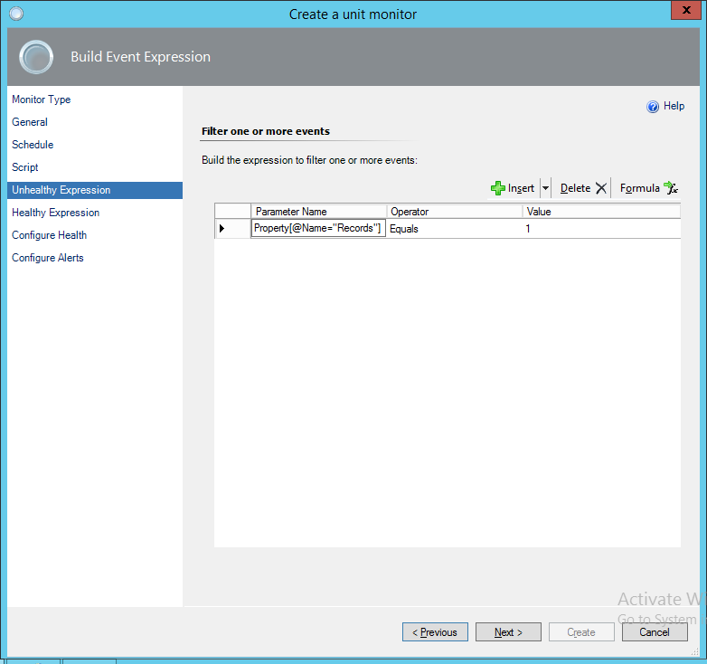

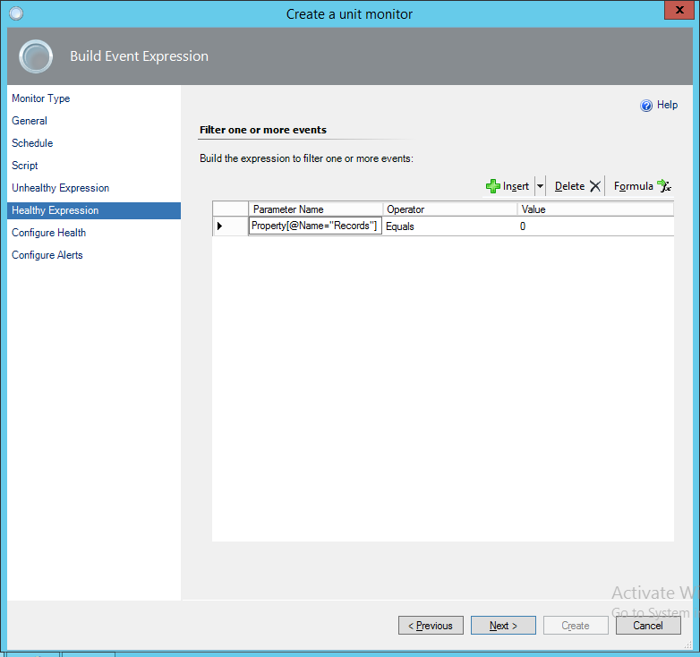

We can grab the data from the property bag returned by the script and use the details in the health expression by grabbing the property by name as shown. Since this is a test monitor and isn't really critical, I'm going to leave the "Configure Health" step as default, and not configure an alert yet, then create the monitor.

# Export the management pack

To export the management pack, browse back to the management pack we created at the beginning, right click it and choose to export it. This will give you an XML file we can go ahead and edit.

# Add the run as reference to the monitor

I've attached the original and the run as versions of the management pack here, showing *almost* no difference between the two files! All I've done is bump up the version number and add the "SecureReference" ID from the secure references section to the chosen UnitMonitor. It's a little easier this way than adding the secure reference from scratch and makes the whole process a bit quicker.

[Here's the diff between the two files on GitHub](https://gist.github.com/davegreen/9b4d6da5ef1a883bd5c4/revisions).

# Re-import the management pack

To re-import the management pack, import the MP back from disk. Make sure you don't change the filename, as this will cause issues with importing, as will any XML validation errors that may have been introduced.

# Complete the configuration

Now we've got over all that, we can now apply an override and try out the monitor!

Navigate back to the Authoring tab and find the monitor you created earlier. Right click it, choose "Overrides > Override the monitor > For a specific object of class: SQL Server YYYY DB". Choose the database you want this monitor to apply to, then click OK.

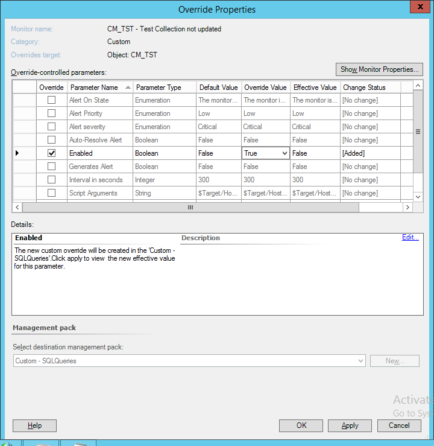

Choose to override the "Enabled" parameter, then click OK.

You'll be able to see the management pack importing on the destination server, if you look at the event viewer for the destination server.

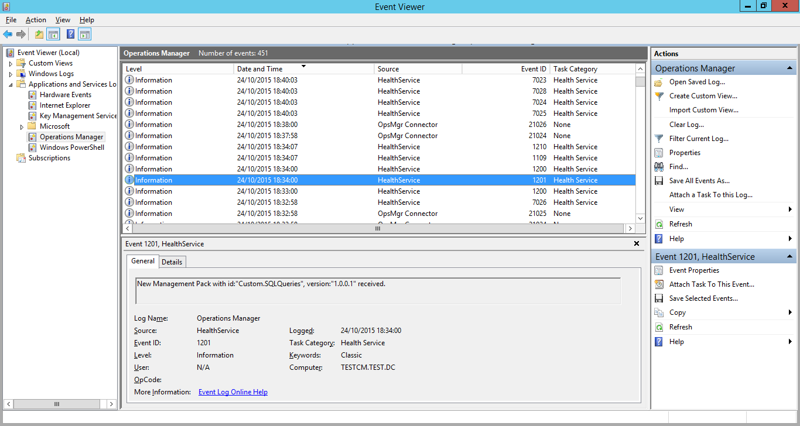

Eventually, you should see the script run. It will log an event under the source "Health Service Script" and should hopefully post the data you need! In this example is a shot of the script failing and posting the error text specified in the script to the event log.

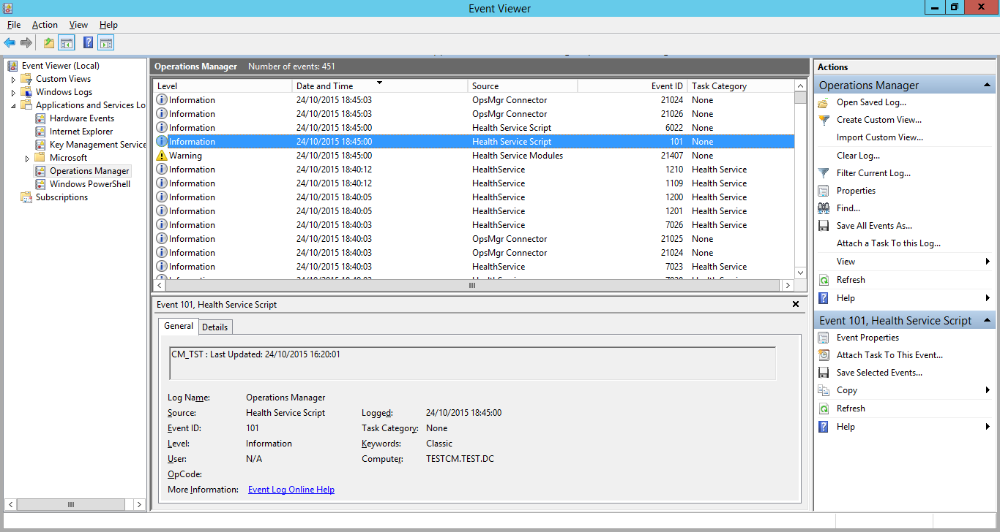

I remove the error state by updating the collection. A while later, the script runs again and sees that the error is resolved.

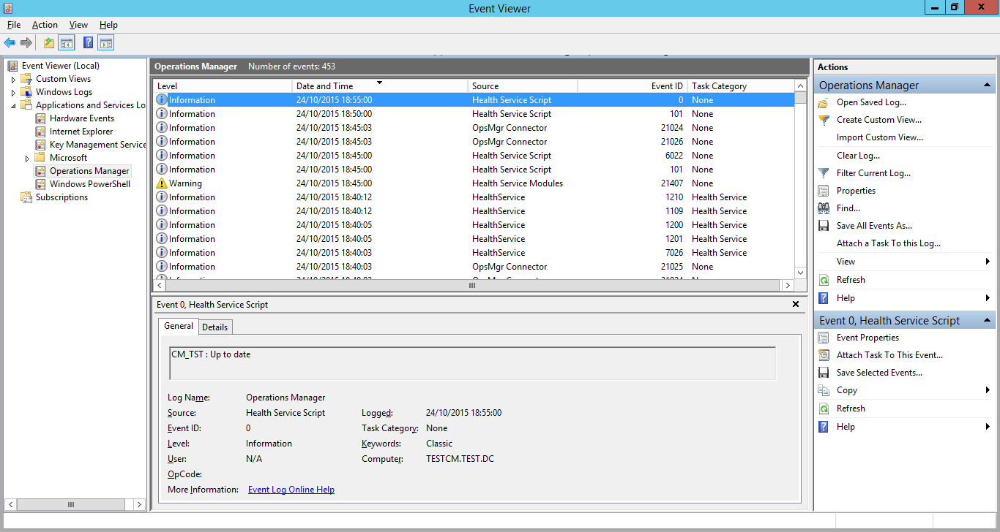

Now we've confirmed it's all working, we can set up the alert. Navigate back to the "Authoring" tab in SCOM and get to the "Alerting" tab in the properties of our monitor.

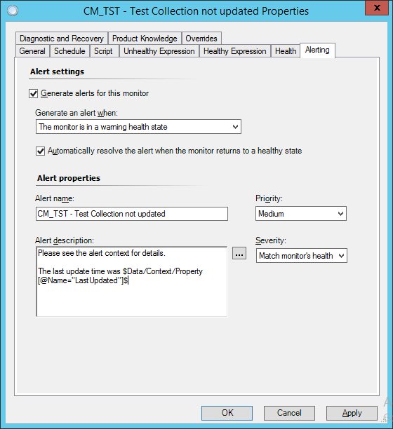

This is an example of a basic alert, including the collection last update time in the alert description by adding the property returned by the script.

I'll cover troubleshooting these kinds of scripts in another post soon, there's a few things to look at to make sure you've covered all the bases. The most important thing is returning the right variable types in the property bag.