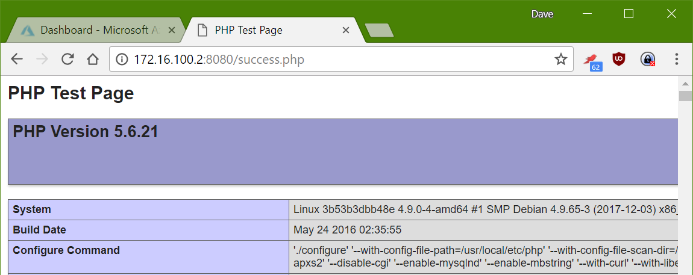

This post is something a little bit different to what I normally post (Hint: Linux :)), but I'm not a platform snob, you've got to use the best tool for the job!

In this case, the customer requirements were to run a PHP5 web application in Apache, with a MySQL backend, plus a few PHP modules and [PhantomJS](http://phantomjs.org/) for charting, so Linux it is.

Before I got involved, the plan was for a two-tier architecture hosted using Azure IaaS VMs. From a customer point of view, this is a reasonably expensive solution, as there is a fair bit of intervention required for maintenance and backups, etc. which would inflate the cost. This solution also falls into a bit of a cost pit from Azure [availability recommendations](https://docs.microsoft.com/en-us/azure/virtual-machines/linux/manage-availability?toc=%2fazure%2fvirtual-machines%2flinux%2ftoc.json), which would require at least 4 VMs, plus load balancing get deployed, making the solution even more expensive.

Essentially, it sounded like a good time to sprinkle some cloud magic on it and see where the infrastructure ended up!

# Initial Idea

I'd heard about Docker containers a bit, from a few people and I knew it would be a good fit for the web frontend for this (assuming I could get it working) and although this would be my first proper foray into using Docker for a production service, I was reasonably confident this would be the way forward. I could always fall back on the old plan, right?

That covers the web frontend you say, but what about the database! For the DB I noticed [this little gem](https://azure.microsoft.com/en-us/services/mysql/) appear not so long ago in Azure, so that's my target for that sorted too! (Yes I know it's preview, but the roadmap points to early 2018 as GA. This app won't be in production before then).

## Let's play... with Docker containers!

The very first step is running up my test machine. Since this is going to be a production service (eventually), my Linux distribution of choice is Debian. You may have a different take on it, but when it's got to be Linux and work in a production environment, I've yet to have a better experience.

Once I've got everything installed (Git, Docker-CE, etc.), it's time to get an initial PHP web app up to test. Since my plan was to deploy a custom Docker image, rather than reinvent the wheel, I wanted to find a base Apache/PHP5 docker image that I could test on Azure, before adding PhantomJS. Luckily, I found the ideal Docker image to start with in the [Azure-App-Service/PHP repository](https://github.com/Azure-App-Service/php) (5.6.21-apache).

I started testing this docker image with a test PHP file I could include, rather than *hostingstart.html*, other than that, I left the Dockerfile as default (for now).

```diff
COPY hostingstart.html /home/site/wwwroot/hostingstart.html
+COPY success.php /home/site/wwwroot/success.php

RUN a2enmod rewrite expires include deflate
```

To run the container, we then just use the standard build and run commands, making sure to map the Apache port through to the host machine.

```bash
docker build -t container .
docker run -d -p 8080:8080 container
```

#### Included test page


#### And just for completeness, my PHP test page



### Getting PhantomJS in the container

Because the requirements of the web app only need the PhantomJS binary and nothing else fancy (like a listen port), we don't need to set up a separate container for PhantomJS, we can just install the package into the container to be used directly by the web application. The largest problem with this, is that the docker image is based on Debian version 8 (Jessie), rather than the current stable release (version 9, 'Stretch'). The PhantomJS package is only available in [jessie-backports](https://packages.debian.org/jessie-backports/phantomjs), whereas in stable, it's in the main package list.

To get this working, this led me to edit the package install RUN line to add the backports repository and make sure that PhantomJS is installed.

This changes the start of the package install RUN line:

```diff
-RUN apt update \
+RUN echo 'deb http://ftp.debian.org/debian jessie-backports main' >> /etc/apt/sources.list \
+    && apt update \
     && apt install -y --no-install-recommends \
         libpng12-dev \
         libjpeg-dev \
         libpq-dev \
         libmcrypt-dev \
         libldap2-dev \
         libldb-dev \
         libicu-dev \
         libgmp-dev \
         libmagickwand-dev \
+        phantomjs \
         openssh-server vim curl wget tcptraceroute \
```

Now I can build the resulting container and test locally, by pushing things into /home/site/wwwroot and as if by magic, it works with either a local or Azure MySQL instance (once I'd added my public IP to the access list :P).

### Build and publish to an Azure Container Registry

I needed a place to store the resulting container artifact, I decided to use an [Azure Container Registry](https://azure.microsoft.com/en-gb/services/container-registry/) for this. I could have used the [Docker Hub](https://hub.docker.com/), but I thought it would be better to keep things in one place.

To deploy the container registry, I used:

```bash
az acr create -n containerregistry -g weblinuxcontainer --sku Basic --admin-enabled true
az acr credential show -n containerregistry
```

I navigated to the Dockerfile folder for my custom container and ran the following:

```bash
docker build -t container .
docker login --username containerregistry --password <password from acr credential> containerregistry.azurecr.io
docker tag container:latest containerregistry.azurecr.io/container:v1
docker push containerregistry.azurecr.io/containerregistry/container:v1
```

### Testing it all out

To test and use this all in Azure we've just got to build the Linux Web App Service plan and create the Web App inside it. Once this is done, we can hook up the Azure container registry to the deployed Web App and then hopefully end up with a web page, or two!

```bash
az appservice plan create -g weblinuxcontainer -n weblinuxplan --is-linux --sku B1
az webapp create -g weblinuxcontainer -p weblinuxplan -n weblinuxapp
az webapp config container set --name weblinuxapp --resource-group weblinuxcontainer --docker-custom-image-name container:v1 --docker-registry-server-url https://containerregistry.azurecr.io --docker-registry-server-user containerregistryuser --docker-registry-server-password <container registry password>
```

The Azure container service should then figure out the website port automagically, if it doesn't you will need to tell Azure, you can do this with:

```bash
az webapp config appsettings set --resource-group weblinuxcontainer --name weblinuxapp --settings WEBSITES_PORT=8080
```

You can then imagine how easy it is to start hooking in Azure MySQL, or another database as the data layer to this app. If your application requires some data to be available to the container, for test purposes or some legacy application storge in an 'uploads' folder there is always the ability to use the app service storage account to keep state within the scale set.

You will need to upload the files over FTP to this storage account. If you do this in production, remember to set backups!

```bash
az webapp config container set --name weblinuxapp --resource-group weblinuxcontainer --enable-app-service-storage true
```

## Final thoughts

Because I am using the built in app service storage account, I tried getting some continuous integration magic working by setting up a trigger on commit for [Visual Studio Team Services](https://www.visualstudio.com/team-services/) to FTP files to the Web App storage to set a really nice development cycle up and running.


This worked... but only with small amounts of files. Once there is over 300 files in the folder structure, I see connection failures start to plague the test deployment, which is annoying! I tried a few things, but haven't managed to get past this yet. I'll push on with this and see where I get, there's a couple more ideas I have in mind to perhaps make this better.

Hopefully this was a nice intro into using custom Docker containers on Azure. It will definitely stay as a good set of notes for me for a while :)