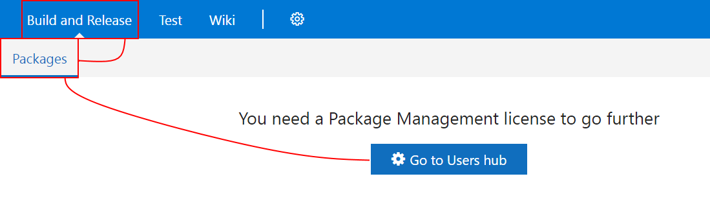
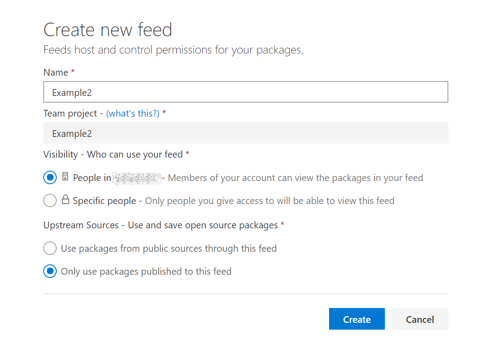
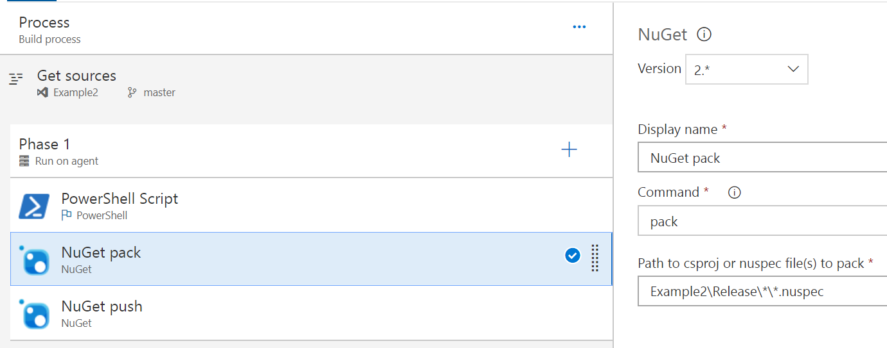
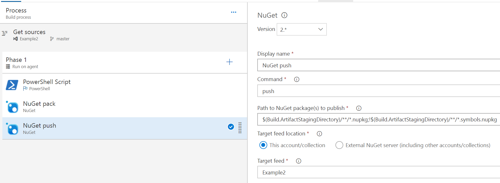

I've been working with VSTS a lot recently as a source management solution. Rather than build and distribute my modules through a file share or some other weird and wacky way, I thought i'd try to use VSTS Package Management to run myself a PSGallery-alike, without running PSGallery! This is related to another coming-soon blog post about building and running a cloud platform business rule compliance testing solution using the VSTS hosted build runner too. 

All of this was to work towards to run things in a little more of a continuous integration (CI) friendly way, hopefully making a start towards a [release pipeline model](https://docs.microsoft.com/en-us/powershell/dsc/whitepapers) for cloud service configurations. 

So i started with [this great guide](https://roadtoalm.com/2017/05/02/using-vsts-package-management-as-a-private-powershell-gallery/) on how to do it manually, creating pakages and pushing them to VSTS Package Management. This works great, but I wanted to close the loop by automatically building my module, along with packing and pushing my nuget packages to VSTS. Here's how I did it...

## Generating the module manifest and nuspec file

You don't have to generate both automagically, I suppose you could generate the nuspec from the module manifest, which would be quite straightforward. My way is not the only ay :) Anyways, based on all the reorganising I do of my modules, it's easier to generate both so I don't have to worry about the module manifest file list or the cmdlets/functions/aliases to export.

I use the a project structure like the one used in the [Plaster](https://github.com/PowerShell/Plaster) module (since that's usually my starting point!). This means that a rough module structure looks like this:

```
\Module
|-\release (.gitignored)
|-\src
| |-Module.nuspec (.gitignored)
| |-Module.psd1   (.gitignored)
| |-Module.psm1
|
|-\test
| |-testfile.test.ps1
|
|-CHANGELOG.md
|-build.manifest.ps1
|-build.ps1
|-build.psake.ps1
|-build.settings.ps1
|-README.md
|-scriptanalyzer.settings.psd1
```

As you can see, most of those files look pretty much identical to those you get from the NewModule example with one or two exceptions. The major one is **build.manifest.ps1** which is the script I use to build the manifest and stitch together all the pieces defining the module. This script gets called as part of the build and creates two files shown in the above structure, **Module.nuspec** and **Module.psd1**.

Here's the content of this file, I've also used it in an example module hosted in GitHub [here](https://github.com/davegreen/PowerShell/tree/master/Modules/Example2).

```powershell
$ModuleName = (Get-Item -Path $PSScriptRoot).Name
$ModuleRoot = "$PSScriptRoot\src\$ModuleName.psm1"

# Removes all versions of the module from the session before importing
Get-Module $ModuleName | Remove-Module
$Module         = Import-Module $ModuleRoot -PassThru -ErrorAction Stop
$ModuleCommands = Get-Command -Module $Module
Remove-Module $Module

if ($ModuleCommands) {
    $Function = $ModuleCommands | Where-Object { $_.CommandType -eq 'Function' -and $_.Name -like '*-*' }
    $Cmdlet = $ModuleCommands   | Where-Object { $_.CommandType -eq 'Cmdlet' -and $_.Name -like '*-*' }
    $Alias = $ModuleCommands    | Where-Object { $_.CommandType -eq 'Alias' -and $_.Name -like '*-*' }
}

Push-Location -Path $PSScriptRoot\src
$FileList = (Get-ChildItem -Recurse | Resolve-Path -Relative).Substring(2) | Where-Object { $_ -like '*.*' }
Pop-Location

$ModuleDescription = @{
    Path                = "$(Split-Path -Path $ModuleRoot)\$((Get-Item -Path $ModuleRoot).BaseName).psd1"
    Description         = 'A PowerShell script module.'
    RootModule          = "$ModuleName.psm1"
    Author              = 'David Green'
    CompanyName         = 'tookitaway.co.uk'
    Copyright           = '(c) 2018. All rights reserved.'
    PowerShellVersion   = '5.1'
    ModuleVersion       = '1.0.0'
    # RequiredModules   = ''
    FileList            = $FileList
    FunctionsToExport   = $Function
    CmdletsToExport     = $Cmdlet
    AliasesToExport     = $Alias
    Tags                = $ModuleName
    # VariablesToExport = ''
    # LicenseUri        = ''
    # ProjectUri        = ''
    # IconUri           = ''
    ReleaseNotes        = Get-Content -Path "$PSScriptRoot\CHANGELOG.md" -Raw
}

[string]$Tags = $ModuleDescription.Tags | Foreach-Object { "'$_' " }

[xml]$ModuleNuspec = @"
<?xml version="1.0"?>
<package>
  <metadata>
    <id>$ModuleName</id>
    <version>$($ModuleDescription.ModuleVersion)</version>
    <authors>$($ModuleDescription.Author)</authors>
    <owners>$($ModuleDescription.Author)</owners>
    <requireLicenseAcceptance>false</requireLicenseAcceptance>
    <description>$($ModuleDescription.Description)</description>
    <releaseNotes>$(Get-Content -Path "$PSScriptRoot\CHANGELOG.md" -Raw)</releaseNotes>
    <copyright>$($ModuleDescription.Copyright)</copyright>
    <tags>$Tags</tags>
  </metadata>
</package>
"@

New-ModuleManifest @ModuleDescription
$ModuleNuspec.Save("$(Split-Path -Path $ModuleRoot)\$((Get-Item -Path $ModuleRoot).BaseName).nuspec")
```

This next small example is from **build.ps1**, showing where the manifest build is called, along with pre-installing any prerequisites needed, as generating the manifest requires me to import the module. I don't currently alter the **build.psake.ps1** file, as I want to be able to easily consume any updates to the psake script (although it should really be in the **build.settings.ps1** in that case!).

```powershell
[CmdletBinding()]

Param (
    [Parameter()]
    [string[]]
    $Task = 'build',

    [Parameter()]
    [System.Collections.Hashtable]
    $Parameters,

    [Parameter()]
    [switch]
    $InstallPrerequisites
)

$psake = @{
    buildFile  = "$PSScriptRoot\Build.psake.ps1"
    taskList   = $Task
    Verbose    = $VerbosePreference
}

if ($Parameters) {
    $psake.parameters = $Parameters
}

# Prerequisites
if ($InstallPrerequisites) {
    if (-not (Get-PackageProvider -Name NuGet -ErrorAction SilentlyContinue)) {
        Install-PackageProvider -Name NuGet -Force -Scope CurrentUser
    }

    'pester', 'psake' | ForEach-Object {
        Install-Module -Name $_ -Force -Verbose -Scope CurrentUser -SkipPublisherCheck
    }
}

. $PSScriptRoot\Build.manifest.ps1
Invoke-psake @psake
```

OK! so hopefully you can implement this file to build your manifest and nuspec file, so you could run your **nuget pack** and **nuget push**, then call it a day, right? Kind of... But wouldn't it be easier for someone else to do the pack and push? Enter VSTS Package Management! You've been commiting all this to source control right?!

## Building the steps for 'pack and push'

To build the steps for pack and push, you need to have the following prerequisites in place (i'm assuming you've already got git, or the first part of this post may have missed the mark):

- [VSTS](https://www.visualstudio.com/team-services/) (obviously!)
- [VSTS Package Management](https://docs.microsoft.com/en-us/vsts/package/install?view=vsts)

Once you've got those installed, read through the getting started with VSTS stuff to get a good grounding in what it's all about, we can push the code to the remote origin, then we can build... the build!

We can add the remote git server with:

> git remote add \<remote name\> \<repository url\>

Then initialise the empty remote server with all our content and history using:

> git push -u \<remote name\> -all

Now we should have our module in VSTS, looking a little lonely, just waiting to get built! We can go to **Build and Release > Packages** to start the process, but we might need to add an extension license before we do that.



Click your user, then click **Manage extensions** and apply the **Package Management license**. After that, we can go back to the **Packages** page to create the new feed, here's a screenshot.



Now we can navigate to **Builds** and click **+ New definition** to create a build definition. We'll use **VSTS Git** and use an empty build definition.


We'll create three steps, a simple build for the module! We're runing build.ps1, which will install the prerequisites like Pester and psake if needed, which for the VSTS build runner, we will require. Then we can build the module into the Release folder and give it a good test before we give it to nuget to pick up in the next step.



This step is almost entirely as-is, just pointing to the expected path of the **Example2.nuspec** file to grab and pack up.



This step again is almost-default and just points to the target feed, nothing else has been changed. You could collect the test results as well, along with some other things to make sure you've collected all the good data about the build, but that's outside the scope of this post.

So now we've got a module, it's built, it's tested, it's packed and pushed and ready to go! So how do we use it?

Remember the package feed we created earlier? Now the feed is created and we've pushed a package to it, it's got a use! If you navigate back to the **Build and Release > Packages**, then click **Connect to feed**, you can then copy the **Package source URL**, changing *nuget/v3* to *nuget/v2* which will look something like this:

> https://<VSTSName>.pkgs.visualstudio.com/_packaging/<TeamName>/nuget/v2

This is the Repository URL for the PSRepository we'll want to register, the only other detail we need will be the Personal Access Token (PAT), details of how to generate one [can be found here](https://docs.microsoft.com/en-us/vsts/accounts/use-personal-access-tokens-to-authenticate?view=vsts) (accessible through your profile security page).

Basically you an use anything for your username, as long as the password is your PAT, it'll connect and let you seach, download and install packages from this feed.

```powershell
$Cred = Get-Credential

$Splat = @{
    Name               = 'PowerShell'
    InstallationPolicy = 'Trusted'
    SourceLocation     = 'https://<VSTSName>.pkgs.visualstudio.com/_packaging/<TeamName>/nuget/v2'
    Verbose            = $true
    Credential         = $Cred
}

Register-PSRepository @Splat

Install-Module -Repository PowerShell -Name Example2 -Scope CurrentUser -Credential $Cred -Verbose
```

The only issue I currently have is that since the package feed is immutable, you have to make sure you have upped the module version in order to get the push to work, or you end up with a build that works, but an error at the end like:

> Error: An unexpected error occurred while trying to push the package with VstsNuGetPush.exe. Exit code(2) and error(The feed already contains 'Example2 1.0.0'.)

I'm unsure how to get my CI process (build + test) running automatically, while also having a build test and release working automatically when I bump the version number. I'll continue to discover new things though and post once I figure it out! Alternatively, if you already know how, please share! :)

And that's it! Hopefully this give you some good information on working with your own PowerShell module CI solutions within VSTS and Package Management.